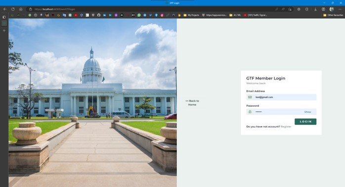

# Garbage Management System


## About The Project
This is a web application for Garbage Management System. This application is developed using ASP .NET Framework and C# programming language. This application is developed for clean garbage areas in sri lanka

## Built With
* [ASP .NET Framework](https://dotnet.microsoft.com/apps/aspnet) - ASP .NET Framework
* [C#](https://docs.microsoft.com/en-us/dotnet/csharp/) - C# programming language
* [SQL Server](https://www.microsoft.com/en-us/sql-server/sql-server-downloads) - SQL Server

## Getting Started
To get a local copy up and running follow these simple steps.

### Prerequisites
* Visual Studio 2019
* SQL Server 2019

### Installation
1. Clone the repo
```sh
git clone https://github.com/ravindu0823/ASP-.NET-Web-Application
```
2. Open the project using Visual Studio 2019
3. Run the project

## Usage
This application is developed for clean garbage areas in sri lanka. This application is developed for both users and admins. Users can register to the system and they can add garbage areas to the system. Admins can manage garbage areas and users. Admins can add new admins to the system. Admins can add new garbage areas to the system. Admins can delete garbage areas from the system. Admins can delete users from the system. Admins can view garbage areas and users.

## Screenshots
### Home Page


### Articles Page


### About Page


### Admin Login Page


### Admin Dashboard Page


### Admin Add Article Page


### Admin Manage Garbage Collectors Page


### Admin Manage Green Captain Page


### Garbage Collector Login Page


### Garbage Collector Dashboard Page


### Garbage Collector Manage Garbage Areas Page


### GTF Login Page


### GTF Dashboard Page
